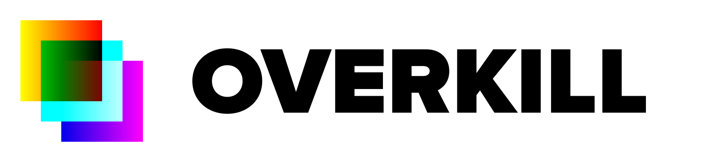

I was told not to go overkill, so I have decided to go **Overkill**.

## What is Overkill

Overkill is a simple shader langauge that's easy to implement even in the smallest of programs.

```
pushc 1
pushv global_coords_x
sub
setv out_pixel_red

pushv global_coords_y
setv out_pixel_green

setv1 out_pixel_blue
```

Overkill shaders (`.overkill`) are converted to Overkill bytecode (`.ovk`). The generated files can then be loaded by the included C library and used in everything from toasters to the particle accelerator in your basement, sis.

## Overkill bytecode

Every `.ovk` file has a specific structure:

|Item|Description|Type|
|-|-|-|
|`magic`|The "magic" identifier, always equal to `OVKL`|`char[4]`|
|`target`|The shader target identifier|`char[4]`|
|`shader`|Shader data|`char[]`|

Identifier (instruction or varying) names specified in this document are followed by their opcodes in parentheses: `add(20)`. Opcodes are in hexadecimal.

### Shader targets

A **shader target** specifies the features supported by the target application. Features include varyings and instructions.

#### Universal target

The univeral target `UNIn` defines the basic feature set of Overkill, and has to be supported by any other shader target based on it.

#### List of shader targets

Here is a list of shader targets currently supported by the compiler:

|Target ID|Name|Based on|
|-|-|-|
|`UNI1`|Universal target version 1|N/A|
|`TGOL`|Game of Life|`UNI1`|

### Varyings

"Varyings" are variables that change between the instances of the shader execution code. Some can change during the execution.

Each varying has an access flag attached to it:
* `R-` - read only
* `RW` - read/write
* `-W` - write only
* `--` - null varying (cannot access)

By default, Overkill comes with 6 varyings:
* `R-`, `global_coords_x(00)` - the X coordinate of the current pixel, <0, 1>
* `R-`, `global_coords_y(01)` - the Y coordinate of the current pixel, <0, 1>
* `-W`, `out_pixel_red(10)` - the R component of the output pixel, <0, 1>
* `-W`, `out_pixel_green(11)` - the G component of the output pixel, <0, 1>
* `-W`, `out_pixel_blue(12)` - the B component of the output pixel, <0, 1>
* `R-`, `random(FF)` - a source of randomness, <0, 1>

#### Game of Life varyings

The [Game of Life](https://github.com/JIMP-HNKS/P1-Life) (`TGOL` target) supports some additional varyings.

* `R-`, `cell_coords_x(20)` - the X coordinate of the current pixel in the cell, <0, 1>
* `R-`, `cell_coords_y(21)` - the Y coordinate of the current pixel in the cell, <0, 1>
* `R-`, `cell_state(22)` - the state of the current cell, 0 or 1

### Instructions (`UNI1` target)

**Data flow:**
* `pushc(10) <float>` - push a constant onto the stack
* `pushv(11) <varying>` - push the value of a varying onto the stack
* `setv0(20) <varying>` - set the value of a varying to 0
* `setv1(21) <varying>` - set the value of a varying to 1
* `setv(22) <varying>` - pop a value from the stack and set it as a value of a varying

**Control flow:**
* `jmp(30) <address>` - jump to a given position in the shader
* `jmp0(31) <address>` - pop a value from the stack, if it's zero, jump
* `jmp1(32) <address>` - pop a value from the stack, if it's one, jump
* `jmpn0(33) <address>` - pop a value from the stack, if it's not zero, jump
* `jmpn1(34) <address>` - pop a value from the stack, if it's not one, jump

**Arithmetic & other math operations:**
* `add(40)` - pops 2 values from the stack, adds them, pushes the result onto the stack
* `sub(41)` - pops 2 values from the stack, subtracts them, pushes the result onto the stack
* `mul(42)` - pops 2 values from the stack, multiplies them, pushes the result onto the stack
* `div(43)` - pops 2 values from the stack, divides them, pushes the result onto the stack
* `sqrt(44)` - pops a value from the stack then pushes its square root onto the stack